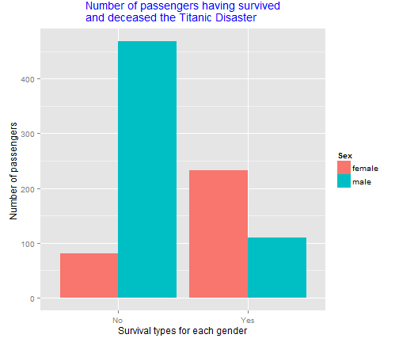

Machine Learning from Titanic Disaster
========================================================
author: Thomas Guenther
date: November, 2014
font-import: http://fonts.googleapis.com/css?family=Roboto+Condensed
font-family: 'Roboto Condensed'
autosize: true

The Titanic Disaster Shiny App
========================================================
This is a simple Shiny App using a Machine Learning algorithm to predict survival probabilities
- You can do a prediction by configuring the Pclass, gender and age 
- Creates a plot based on your input parameters showing your prediction result together with computed survival probabilities for the gender you selected
- Shows a table with the dataset used for plotting the probability scatterplot
- Generate some basic plots visualizing the Titanic data set

References

<small>The used Titanic data set: [http://www.kaggle.com/](http://www.kaggle.com/)</small>
<small>Visit my Github repository: [The Titanic Disaster Shiny App](https://github.com/dreammaster38/coursera_developing_data_prods_pa)</small>

Technical details
========================================================

- Uses a Machine learning algorithm based on Random Forests to create the model
- model accuracy ~88%
- OOB error is 18.52%% (this could be better)
- As you can see the model's accuracy isn't perfect and should be improved
- uses multiple CPU cores while model creation (if possible, deactivated for shyniApps.io)
- plots will be generated via `ggplot2` package for maximum flexibility

Survival Plot
========================================================

<small>This plot shows how many male and female passengers have survived and deceased the Titanic Disaster.</small>


```r
plot <- ggplot(data=survivalCountForGender, aes(x=Survived, y=Count, fill=Sex)) + geom_bar(stat="identity", position=position_dodge()) + xlab("Survival types for each gender") + ylab(expression("Number of passengers")) + ggtitle(expression("Number of passengers having survived\nand deceased the Titanic Disaster")) + theme(plot.title = element_text(color="blue", size=14, vjust=1.0))
print(plot)
```

 

Conclusion
========================================================
Known Bugs of the TabPanel 'Could you have survived?'
- <small>if changing one select input after a plot was already created  the plot refreshes immediatly but a click of the button *'My survical Odds'* is needed to create the real plotting result</small>
- <small>if a high age value was selected the points in the plots are shifting to the left</small>

Improvements for future versions beyond bugfixing
- <small>Improve UI, so elements are only shown if needed</small>
- <small>differentiate between adults and children</small>
- <small>increase accuracy of the model by tuning model parameters and features</small>
- <small>experiment with different methods of imputing missing data</small>
- <small>try other Machine Learning algorithms like SVM, GLM and so on</small>

Thanx, Thomas G., November 2014
